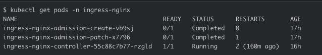
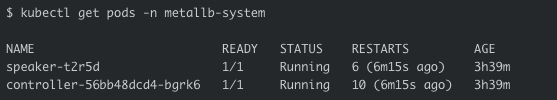
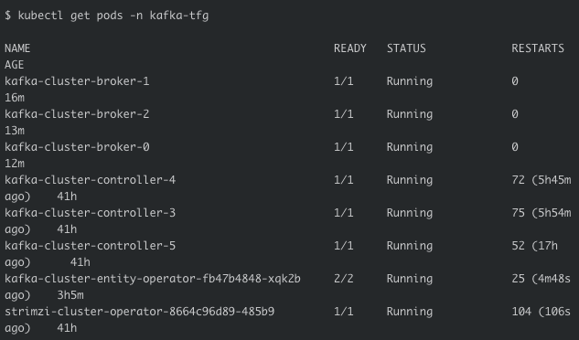
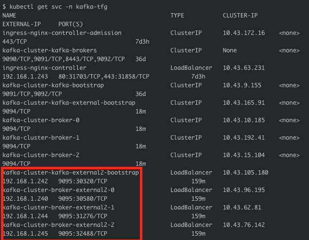
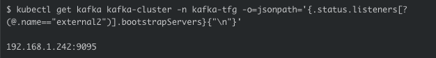
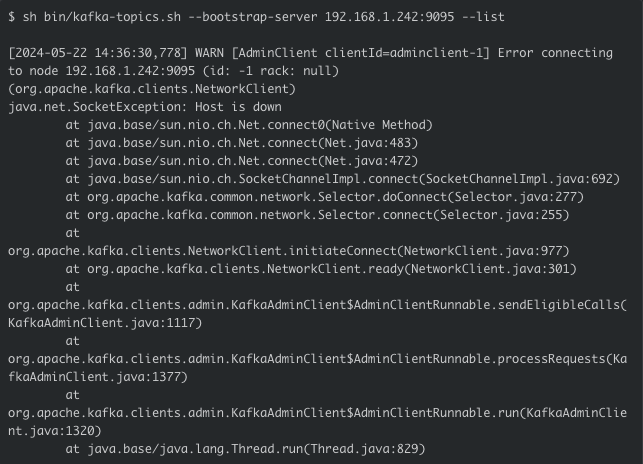

### Explicacion de archivos principales. 

1. El cluster de Kafka en Kubernetes es desplagado por el operador **Strimzi**. 

* Primero se instala el cluster que es el [manifiesto](https://github.com/strimzi/strimzi-kafka-operator/blob/main/install/cluster-operator/060-Deployment-strimzi-cluster-operator.yaml). Este usa por debajo toda la configuracion que ya viene por default con este operador **Strimzi**
* Una vez instalado se aplica el manifiesto de los brokers y controllers. Que son necesarios para que Kafka funcione dentro del cluster. Por lo tanto, se aplica el [deployment](manifests/cluster-kraft-mode.yaml). Aqui se encuentra toda la logica donde se configuran los listeners. En estos momentos se tiene un internal y dos external: uno para usar con Nginx y otro para el LoadBalancer que se esta usando MetalLB.

1. **Nginx**: Se instala Nginx en un namespace nuevo. 
2. **MetalLB (LoadBalancer)**: Los manifiestos para configurar el LoadBalancer son: [ipadresspool](manifests/ipaddresspool_simple.yaml) y [l2adv](manifests/l2adv_selects_pools_by_list.yaml) para seleccionar la direccion de IP.

### Imagenes de apoyo
Listamos los diferentes namespaces: del proyecto, el de Nginx, y el del LoadBalancer. 

#### Nginx

#### LoadBalancer

#### Project Kafka

Now, ready the services of my namesapce at the end notice that if there are the names of the LoadBalancer brokers with the respective IP assigned that according to the port specified at the time of deploying the cluster is 9095.

Now, the listeners with their IP, which in this case is: 192.168.1.242:9095

Finalmente, se hace una peticion desde la CLI usando la direccion IP del loadbalancer con el respectivo puerto y dice que el **Host is  down** realizo un **ping** y tampoco responde: 

